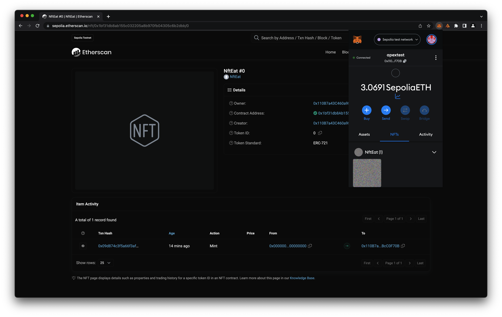

# NftEat

Follow the instructions on [Alchemy University](https://university.alchemypreview.com/course/ethereum/md/how-to-mint-nfts) to mint your own NFT!

## NFT

-   [NFT generator](./nft/nfteat.py)

## IPFS

-   [Image](https://ipfs.io/ipfs/QmRmixAJpapKUsTtrQ2oC4WUdGkygdLyoTMzMmjooPMPcX?filename=nfteat.png)
-   [Metadata](https://ipfs.io/ipfs/QmNNgQpoHmaAHtVTn3h1ZDaHcN9M6shD9pxRPfec9Cty1J?filename=QmNNgQpoHmaAHtVTn3h1ZDaHcN9M6shD9pxRPfec9Cty1J)

## Sepolia Mint

### [0x1bf31db8Ab155c032205A8b970fB04305C6B2dBb](https://sepolia.etherscan.io/nft/0x1bf31db8ab155c032205a8b970fb04305c6b2dbb/0)

